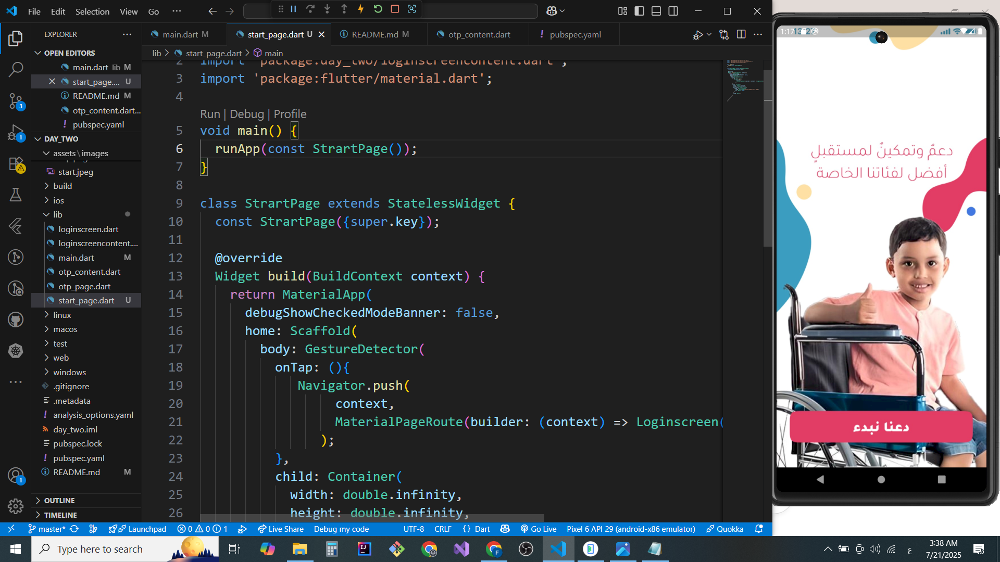
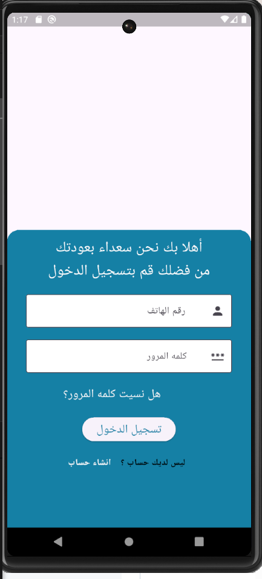
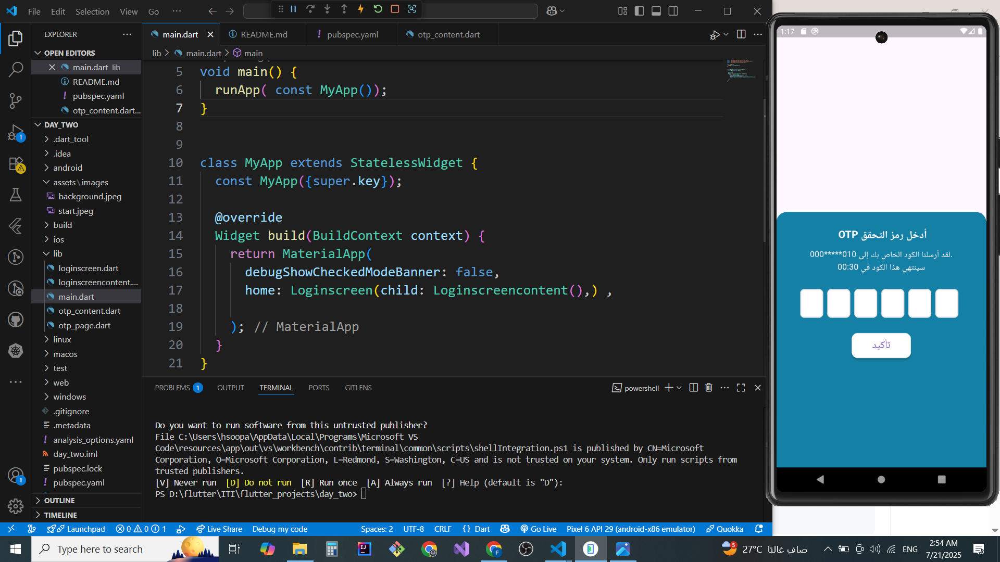
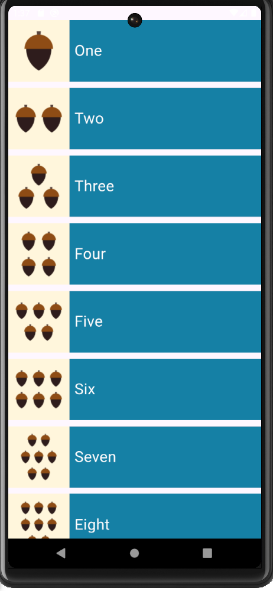

## 📱 Flutter UI Project

This is a simple Flutter project that demonstrates basic navigation and screen setup using images and buttons.

### ✅ Features Implemented:

1. **Home Screen**
   - Background is set to a full-screen image.
   - When the image is tapped, the user is navigated to the **Login Screen**.

2. **Login Screen**
   - Contains login form (Email & Password fields).
   - When the user taps **"Forgot Password?"**, they are navigated to the **OTP Verification Screen**.

3. **OTP Screen**
   - Displays 6 input fields to enter a verification code.
   - Includes a countdown timer and a confirmation button.

4. **Numbers Page**

   - Navigated to after tapping the "Confirm" button in the OTP screen.

   - Displays a ListView.separated containing numbers from 1 to 10 written in English words (e.g., One, Two, ..., Ten).

   - Each list item includes the number and an associated image.

5.  **New Navigation Flow:**

   - After entering the verification code on the OTP Screen, the user taps the "Confirm" button.

   - The app navigates to the Numbers Page.

   - This screen displays a scrollable list with:

   - English number words (from One to Ten).

   - An image next to each number.

  

### 🔧 Technologies Used:
- Flutter SDK
- `flutter_otp_text_field` package

---

### 📸 Screenshots:
<h3>🏠 Start Page</h3>

<h3>🔐 Login Page</h3>

<h3>🔢 OTP Page</h3>

<h3>📋 Numbers Page</h3>
 

